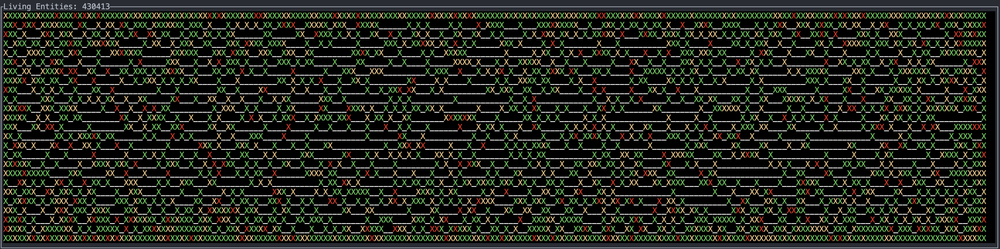

# ECS Test Program

## Description

I thought it might be interesting to make a toy ECS system, so this is that system.  The program basically simulates particles randomly moving around a grid.  The visual is relatively neat to watch, but the main goal of this project had nothing to do with the particles that are moving and, instead, had to do with making an ECS system that was capable to utilizing a high degree of parallelism.

While testing on an mac with a 2.6 GHz 6-Core Intel Core i7, I was able to achieve ~60 fps with 500,000 entities.  Obviously this is sub-ideal, but the main barrier to better frame rates is not having as many systems that request the same data.  For example, the position_update_system, velocity_update_system, and acceleration_update_system rely on each other so they cannot be run in parallel leading to a slowdown.

## Interesting Behavior

The particles seem to swarm the center of the screen in the beginning and then rush to the edges with a few particles making journeys through the middle of the area.

## Pictures

